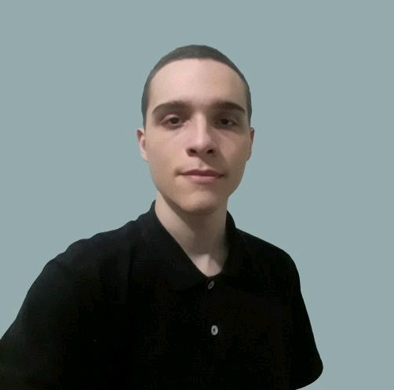

# Rafael Bettini Dias - Portfólio

## Introdução

Este portfólio reúne os projetos integradores realizados durante o curso de Análise e Desenvolvimento de Sistemas e as tecnologias e soft skills desenvolvidas e utilizadas.

# Sumário
- [Rafael Bettini Dias - Portfólio](#rafael-bettini-dias---portfólio)
- [Sobre mim](#sobre-mim)
- [Principais Conhecimentos](#principais-conhecimentos)
- [Projetos](#meus-projetos)
- [Redes Sociais](#redes-sociais)

## Sobre mim
Estudante de Análise e Desenvolvimento de Sistemas na Fatec São José dos Campos. Atualmente faço estágio de TI na Prefeitura de São José dos Campos.
Minhas principais Hard Skills são as linguagens Javascript para Backend e Frontend com React e C# para desenvolvimento de jogos.

## Principais Conhecimentos
Meus principais conhecimentos em tecnologias são:
* Javascript/Typescript para desenvolvimento backend e frontend utilizando React e React Native
* C# para desenvolvimento backend utilizando .NET Core e Entity Framework, e também para desenvolvimento de jogos.
* HTML/CSS para páginas web
 
 
## Meus Projetos
* [Safe House - 2020-1](https://github.com/Rafael-BD/Portifolio/blob/main/projetos/api-1.md)
* [Sistema de Controle de Jornada de Trabalho - 2020-2](https://github.com/Rafael-BD/Portifolio/blob/main/projetos/api-2.md)
* 

## Redes Sociais
* [GIT](https://github.com/Rafael-BD)
* [LinkedIn](https://www.linkedin.com/in/rafael-b-990835209/)

