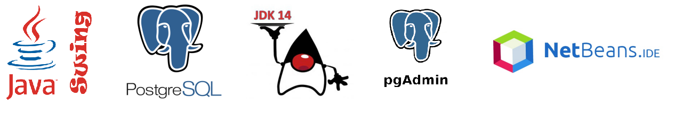
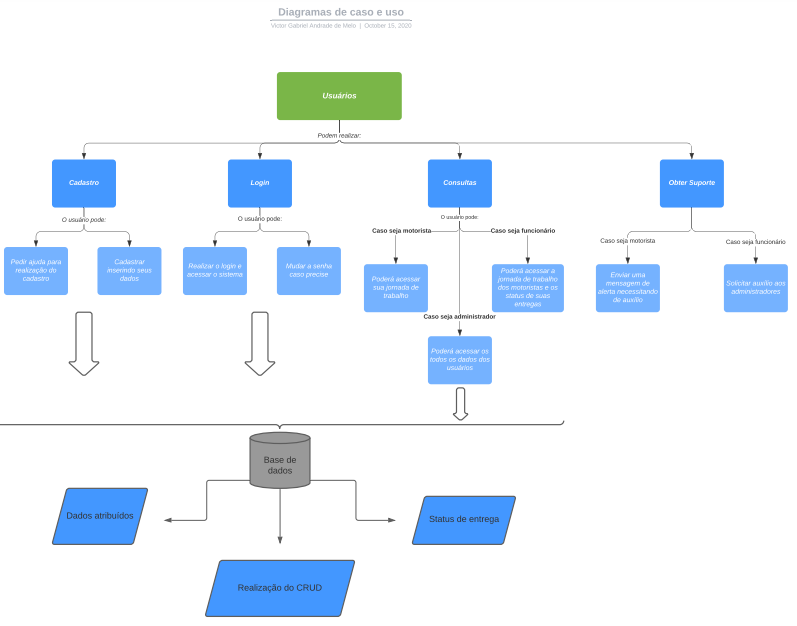

### Em 2020-2
  Foi desenvolvido o segundo projeto em parceria com a empresa [IACIT](https://www.iacit.com.br/), onde foi proposto o desenvolvimento de um sistema desktop de controle de jornada de trabalho para motoristas de forma parametrizável, contendo funcionalidades de controle, planejamento e acompanhamento das jornadas.

[GIT](https://github.com/Rafael-BD/PI_2020.2)

#### Tecnologias Utilizadas

#### Contribuições Pessoais
Neste projeto eu contribuí no desenvolvimento frontend da aplicação utlizando JavaFX para a construção das telas de cadastro e login. Foi necessário projetar os respectivos campos para inserção de login e senha na tela de entrada e para a tela de cadastro de motoristas foi feito as áreas para inserção de novos motoristas e também a visualização dos ja cadastrados. Além disso também desenvolvi as rotas de conexão com o backend responsáveis por recuperar a lista com os  motoristas cadastrados e exibi-los na tela.

#### Hard Skills
As Hard Skills desenvolvidas ao longo deste projeto foram: 
* Linguagem Java para desenvolvimento backend utilizando arquitetura MVC
* JavaFX para construção de telas desktop para aplicações Java
* PostGreeSQL como banco de dados relacional para o armazenamento dos dados de motoristas e suas respectivas jornadas 

#### Soft Skills
As Soft Skills desenvolvidas e utilizadas foram:
* Trabalho em equipe - Fundamental para um trabalho coordenado
* Proatividade - Foi importante um time proativo para conseguir superar as dificuldades em relação ao uso das tecnologias que não tinhamos muito conhecimento
* Criatividade - Tive que desenvolver a criatividade para projetar o design das telas de forma que ficaria intuitiva e agradável

### Diagrama de caso e uso

